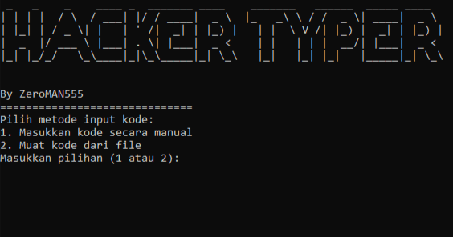

# Hacker-Typer
Hacker Typer for fun


# Nano Editor Simulation with Hacker Typing Effect
Simulasi editor **nano** dalam Python menggunakan `curses` untuk efek visual yang sinematik. Editor ini dirancang untuk menampilkan kode secara dramatis, seolah-olah sedang diketik karakter demi karakter. Sangat cocok untuk perekaman video atau tampilan hacking yang realistis dalam adegan film pendek atau produksi konten.
.png)
## Fitur Utama
- **Simulasi Efek Pengetikan**: Menghadirkan suasana seperti *hacker typer*, dengan kode yang muncul satu per satu saat keyboard diketik
- **Tampilan Editor Nano**: Header, status bar, dan footer dirancang mirip editor nano asli di Linux.
- **Pengisian Otomatis dari File**: Muat kode langsung dari file eksternal atau masukkan kode secara manual.

## Cara Menggunakan
1. **Install**:
   ```bash
   pip install -r requirements.txt

2. **Usage**:
   ```bash
   python3 typer.py
